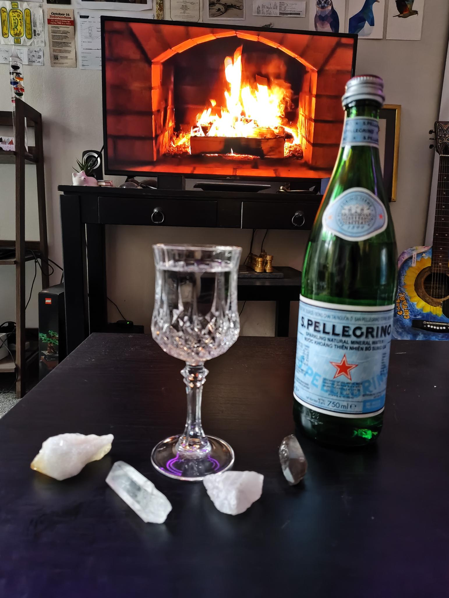
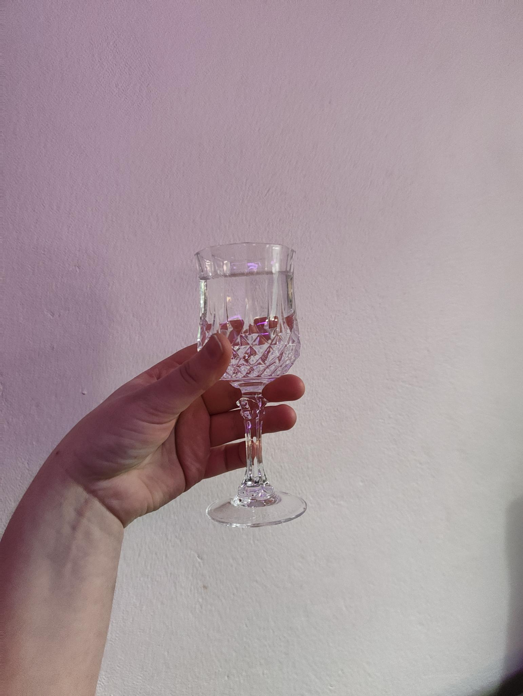

+++
date = '2026-08-09T15:44:00+11:00'
draft = true
title = 'On Crystal'
+++

I was rummaging throuh the local op shops today, predominately looking for a three-piece charcoal pinstripe suit (no luck in that area). What I did walk away with was three crystal glasses.

Thirsty from my ventures, I ducked into Harris Farm Markets to pick up a bottle of San Pellerino.

Several years back, my local Rotary club would hold monthly markets, where people would sell their homemade jams and dusty trinkets. A frequent merchant was an older, ambiguously Central European woman who would trap you in her monologues if you wandered too closely into her midst. One subject in particular she was very passionate about.

> "This isn't regular glass. This is authentic Bohemian crystal, straight from the Czech Republic. Very high lead content. Do you know how you can tell whether it is authentic? Flick the glass. Hear that rich, deep ring? Only true crystal sounds like this."

I was flicking all the glassware available at that op shop. Near everything only responded with a dull thud. What I walked away with, though, rang beautifully.

Cheers. *clink*.
