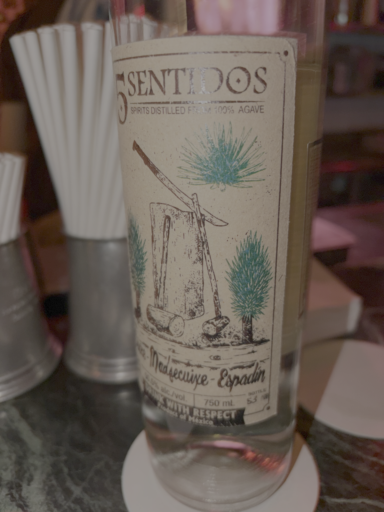

+++
date = '2026-06-28T14:53:00+11:00'
draft = true
title = 'W&P try Mezcal'
+++

Last Friday we stopped by [Palomino Lounge Enmore](https://www.palominolounge.com.au/) cause Wanky walked by the bar, asked if they have patience for "bullshit", and they kinda-sorta said yes. 

Great people, highly recommend how excited they were to take us through things. Also patient considering the intro.

At some point, images were taken, and a mutual friend was texted unsolicited tasting notes. 

It was his fault for introducing Wanky to Mezcals. 

Wanky has forgotten almost anything about the terminology. There was **petradato**? There was something about the agave? Wanky might have lost all the terms and that is not a reflection on the staff.

## Highlights

- Mezcal is apparently not just "smoky tequila" .. Wanky was lied to and is still processing their feelings about it.

- The staff were awesome. Eased us into it, we kinda started floral tequila-y.

- Got to more intense flavours. That-herb-from-great-british-bakeoff when they want a "soft flavor" but taste like liqourice when overdone.

- One mezcal tasted like fermented yoghurt as we pushed towards the extremes of the flavor canyon. 

- The standout was Pretentious' last order that tasted unmistakably like BBQ Sause. I'm still hungry after tasting it.

- Wanky started chasing the smokier stuff.. at which point all parties agreed Wanky's palate is shot.

## Takeaway

[Palomino Lounge](https://www.palominolounge.com.au/), Cool Place, definitely had a claim to "best variety of Mezcal".

Mezcal is cool. Huge range, not fun "let's do a shot" but has personality, a bit of punch. 

Not the peaty "sit down and have an hour long tasting session of a single pour", but pretty interesting regardless.
